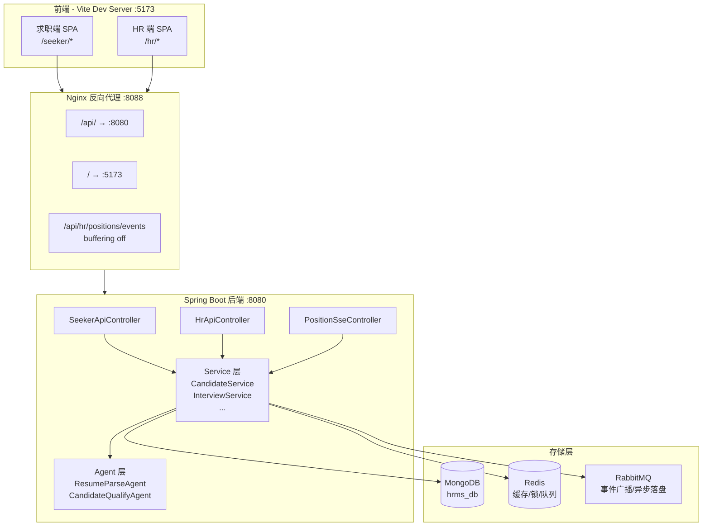
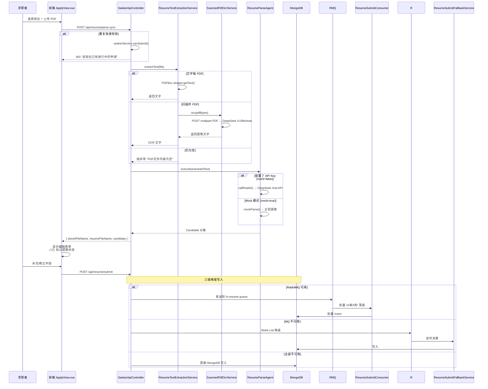
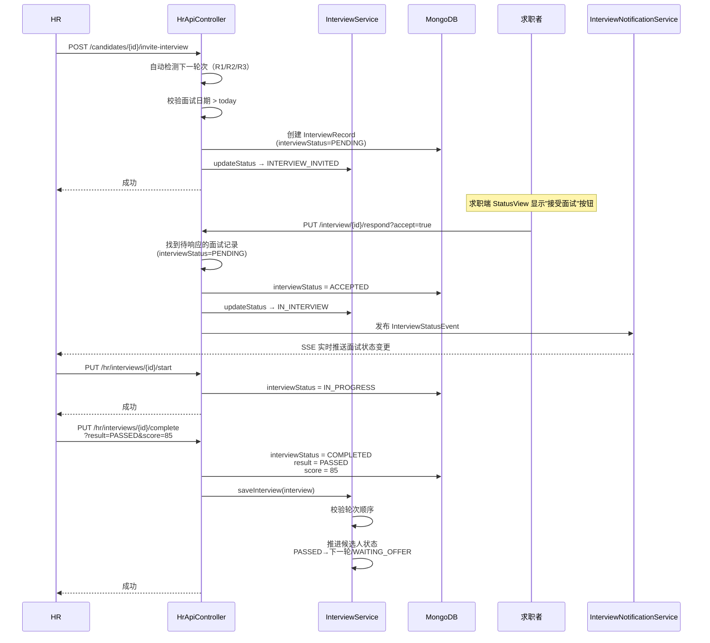
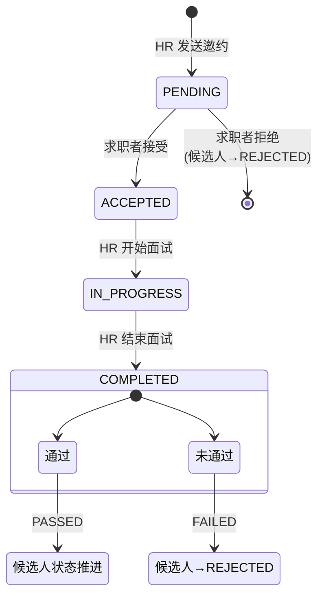
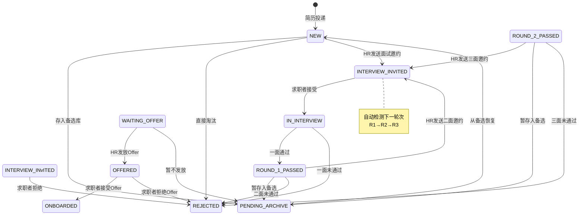
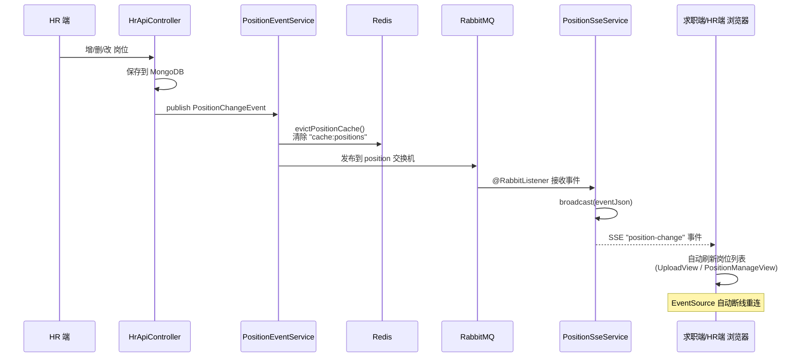
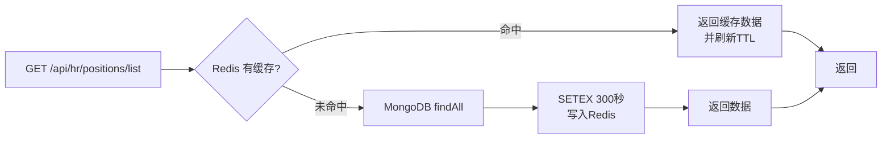
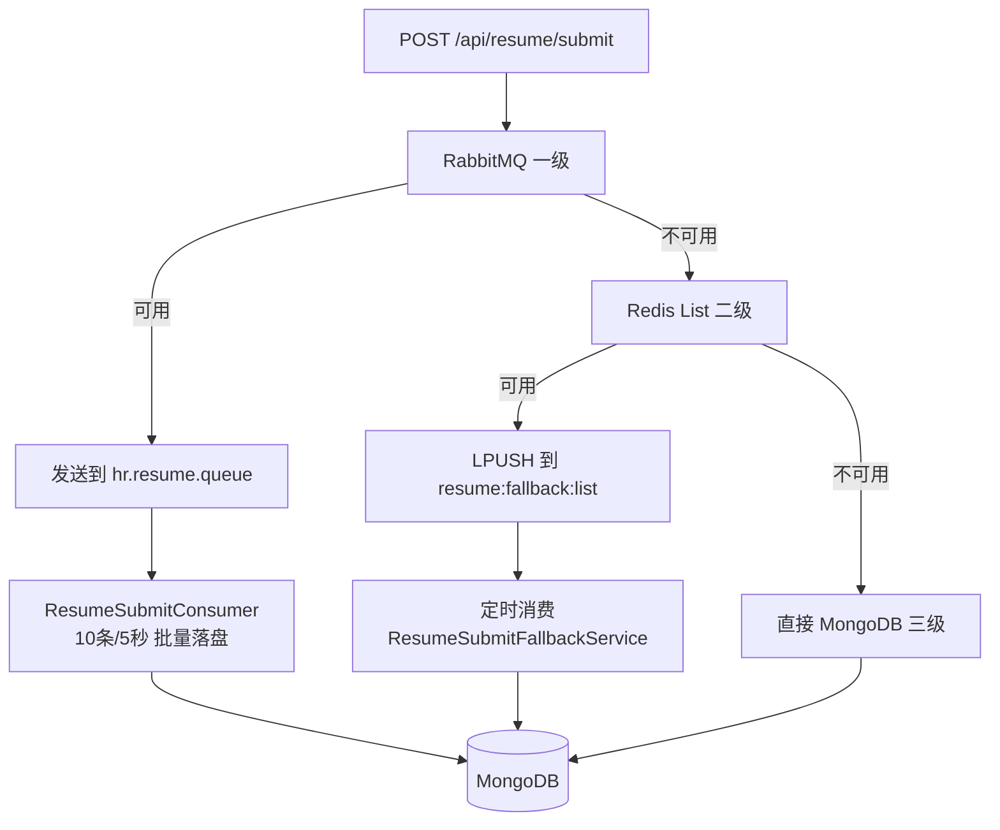
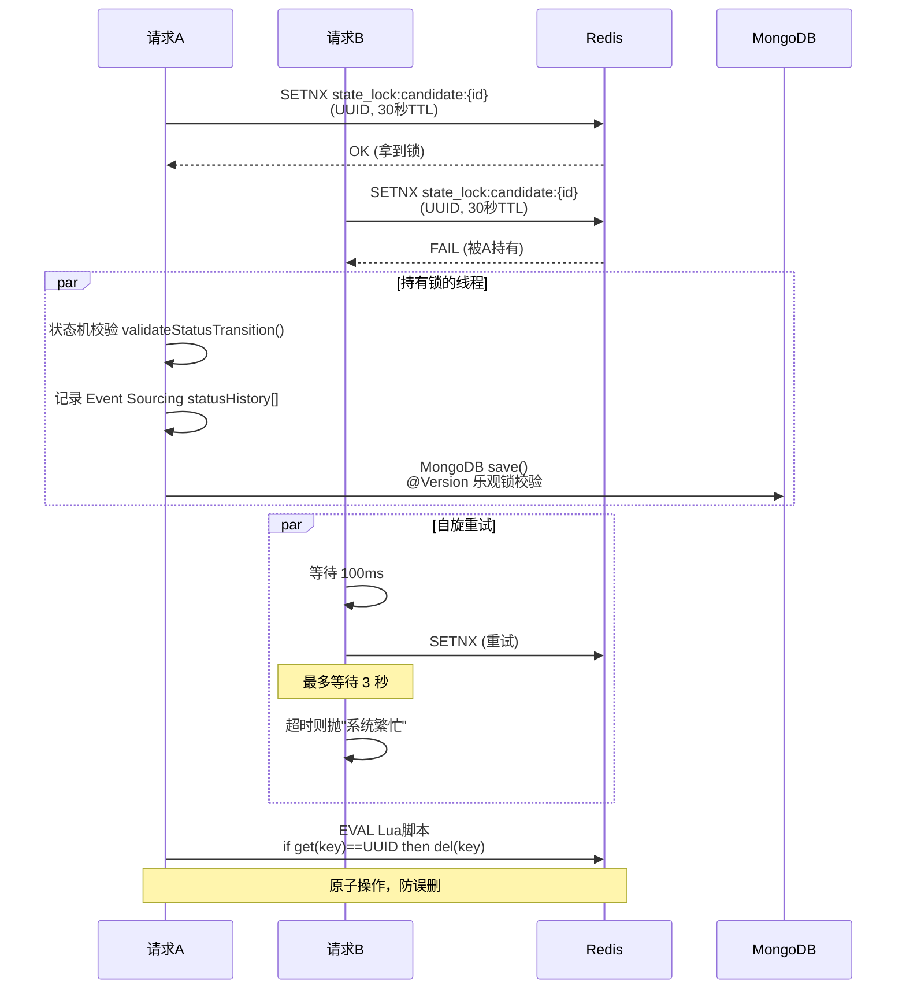

# 流程图文档

> 本文件使用 Mermaid 语法绘制流程图，在 GitHub/GitLab 上可自动渲染。

---

## 1. 架构总览



---

## 2. 简历解析流程



---

## 3. 面试生命周期



### 面试记录生命周期



---

## 4. 候选人状态机



### 状态流转规则

| 当前状态 | 允许的下一个状态 | 说明 |
|----------|-----------------|------|
| NEW | PENDING_ARCHIVE, REJECTED, INTERVIEW_INVITED | 初始状态 |
| PENDING_ARCHIVE | NEW | 双向可逆 |
| INTERVIEW_INVITED | IN_INTERVIEW, REJECTED | 由求职者决定 |
| IN_INTERVIEW | ROUND_1_PASSED, REJECTED | 一面结果决定 |
| ROUND_1_PASSED | INTERVIEW_INVITED, PENDING_ARCHIVE, REJECTED | 等待二面 |
| ROUND_2_PASSED | INTERVIEW_INVITED, PENDING_ARCHIVE, REJECTED | 等待三面 |
| WAITING_OFFER | OFFERED, PENDING_ARCHIVE | 三面通过 |
| OFFERED | ONBOARDED, REJECTED | 由求职者决定 |
| ONBOARDED | — | 终态 |
| REJECTED | — | 终态 |

---

## 5. 岗位实时同步（SSE）



### Redis 旁路缓存



---

## 6. 三级降级写入

### 简历提交降级



### 面试通知降级

```mermaid
flowchart TD
    A[面试状态变更<br/>InterviewStatusEvent] --> B[RabbitMQ 一级]
    B -->|可用| C[发送到 hr.interview.queue]
    C --> D[PositionSseService 消费]
    D --> E[SSE 广播给 HR 端]
    
    B -->|不可用| F[Redis List 二级]
    F -->|可用| G[RPUSH 到 interview:notification:list]
    G --> H[定时消费]
    H --> E
    
    F -->|不可用| I[直接 SSE 广播 三级]
    I --> E
```



---

## 7. 分布式锁机制



### 三层一致性保障

| 层级 | 技术 | 作用 |
|------|------|------|
| 第 1 层 | MongoDB @Version 乐观锁 | 防止并发写覆盖 |
| 第 2 层 | Event Sourcing statusHistory[] | 每次状态变更生成审计记录 |
| 第 3 层 | Redis SETNX + Lua 原子释放 | 跨实例互斥 + 自旋重试 |

---

## 8. 面试轮次校验

```mermaid
flowchart TD
    A[HR 发送面试邀请] --> B{检查已有面试记录}
    
    B -->|无记录| C[ROUND_1]
    B -->|R1 已通过| D[ROUND_2]
    B -->|R2 已通过| E[ROUND_3]
    
    C --> F[创建 R1 面试记录<br/>interviewStatus=PENDING]
    D --> G{校验 R1 是否 PASSED}
    G -->|是| H[创建 R2 面试记录]
    G -->|否| I[抛异常<br/>"一面未通过，无法进入二面"]
    
    E --> J{校验 R2 是否 PASSED}
    J -->|是| K[创建 R3 面试记录]
    J -->|否| L[抛异常<br/>"二面未通过，无法进入三面"]
```

---

## 9. Agent 热插拔架构

```mermaid
flowchart LR
    subgraph Config[application.properties]
        P["hr.agent.resume-parse.enabled=true<br/>hr.agent.resume-parse.ai.mock=true<br/>hr.agent.resume-parse.ai.model=gpt-4o-mini"]
        Q["hr.agent.candidate-qualify.enabled=true<br/>hr.agent.candidate-qualify.ai.mock=true"]
    end

    subgraph Registry[AgentRegistry]
        A1[ResumeParseAgent<br/>@ConditionalOnProperty]
        A2[CandidateQualifyAgent<br/>@ConditionalOnProperty]
    end

    Config -->|配置注入| Registry
    Registry -->|execute("resume-parse", text)| A1
    Registry -->|execute("candidate-qualify", candidate)| A2
    A1 -->|mock=true| R1[正则提取]
    A1 -->|mock=false| R2[DeepSeek Chat API]
    A2 -->|mock=true| R3[加权评分]
    A2 -->|mock=false| R4[DeepSeek Chat API]
```
